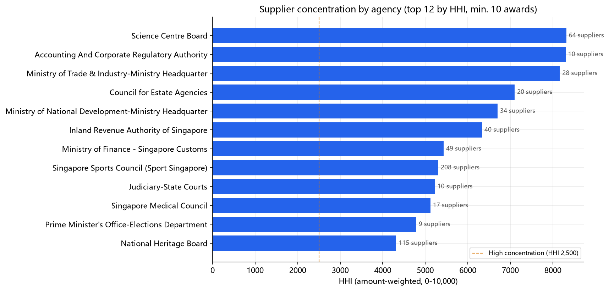
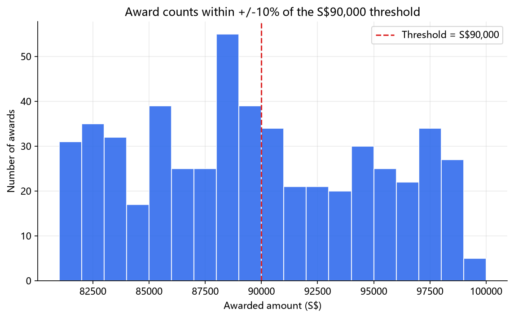
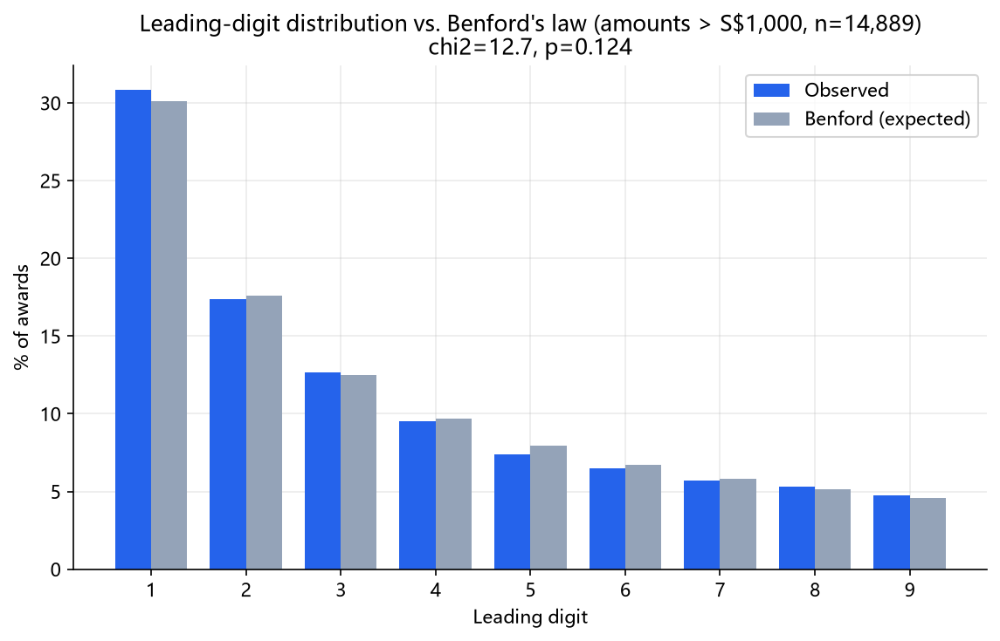
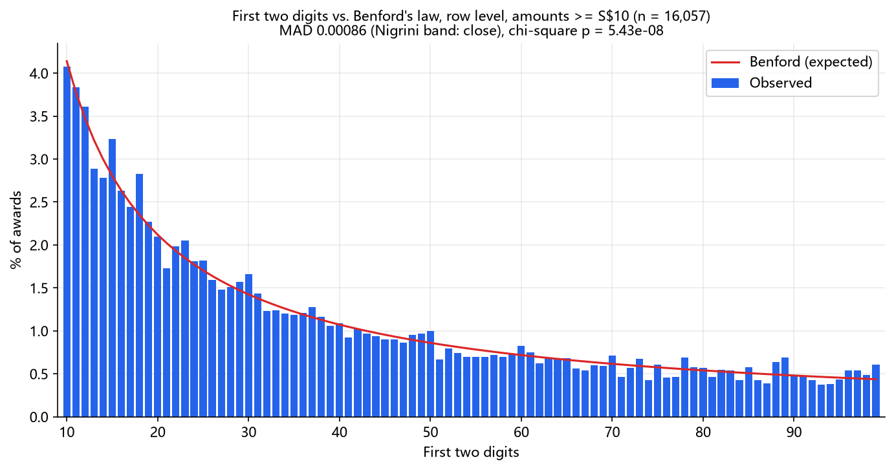
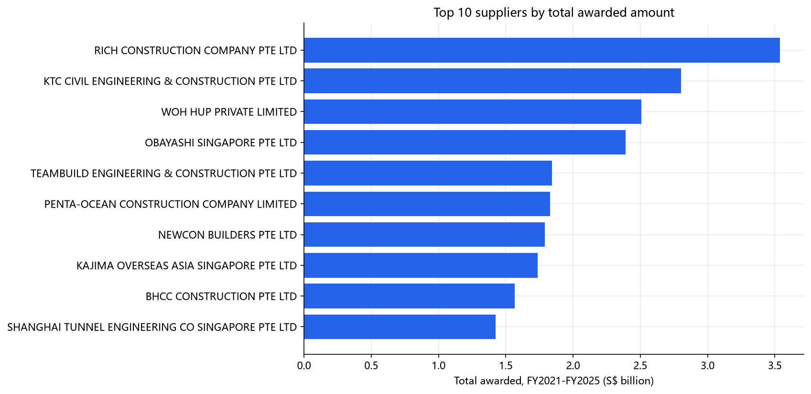
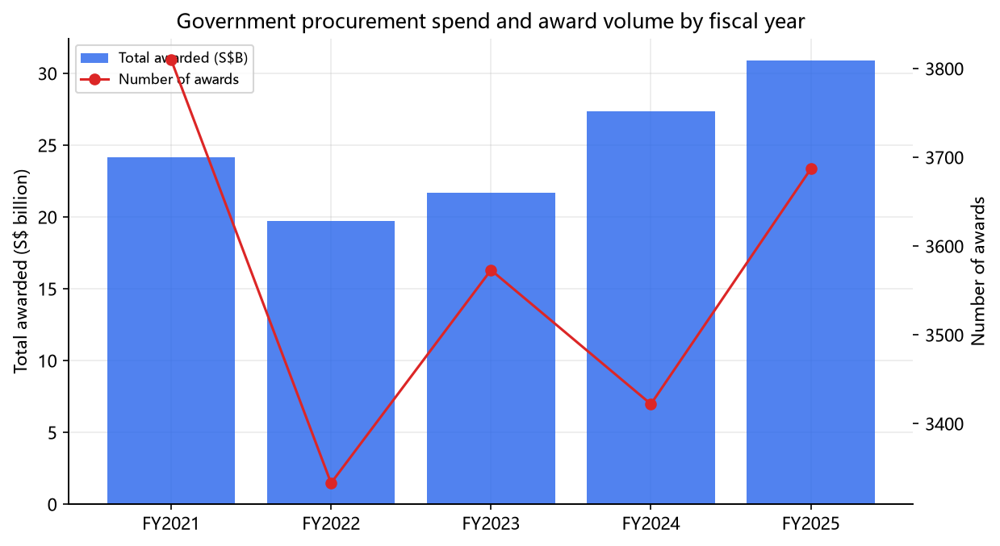

# Singapore Government Procurement (GeBIZ) — Audit Analysis

Using Singapore's publicly disclosed government procurement award data, can we
identify supplier concentration, amount-threshold clustering, and Benford's-law
deviations that would be worth flagging for a closer procurement audit?

## Data

- **Source:** [data.gov.sg — Government Procurement via GeBIZ](https://data.gov.sg/datasets/d_acde1106003906a75c3fa052592f2fcb/view) (Ministry of Finance), Open Data Licence
- **Scale:** 18,464 award records, 7 columns (`tender_no`, `tender_description`, `agency`, `award_date`, `tender_detail_status`, `supplier_name`, `awarded_amt`) across **113 agencies** and **6,152 raw supplier-name strings**
- **Time span:** exactly **FY2021 – FY2025** (1 Apr 2021 – 31 Mar 2026, Singapore fiscal year). This is a rolling 5-year window data.gov.sg publishes, **not** a full historical archive — see [Limitations](#limitations)
- **Scope:** the dataset page describes the data as the open tenders called by government agencies since FY2021. Quotations and small value purchases are not included. Every coded tender number carries the code `ETT` (17,139 rows after cleaning); 686 interface-record rows have no code. No official definition of the code was found.

## Key findings

**1. Agency-level supplier concentration is often high, even with dozens of suppliers on record.**
Several agencies show HHI above 4,000 (Science Centre Board: 8,314 with 64 suppliers; Singapore Sports Council: 5,305 with 208 suppliers) — because one or two large contracts dominate *dollar* spend while many smaller suppliers share the remainder. A single whole-of-government HHI, by contrast, is close to zero and not meaningful — it conflates thousands of unrelated procurement categories.



**2. At tender level, award amounts do not cluster below the S$90,000 tender threshold.**
The threshold applies to a whole procurement, so awards were summed per `tender_no` before testing (10,909 tenders coded ETT; 504 interface-record tenders without a code excluded). Within ±10%, ±5% and ±2% of S$90,000 there are fewer tenders just below than just above (±2%: 25 below, 38 above), and a one-sided binomial test of "more below than above" gives p = 0.837, 0.747 and 0.962. The same test at seven placebo thresholds between S$70,000 and S$120,000 gives p < 0.05 in 1 of 21 cases, about the number expected by chance across 21 tests. Counting individual award rows instead does show more awards below (±2%: 82 below, 51 above, p = 0.005), but that excess disappears once line items are summed per tender.

The data contains only open tenders, so it could not show avoidance of open tender in any case, and the rule is set on estimated value while the data has awarded amounts only.



**3. Award amounts of S$10 or more follow Benford's law closely overall; 8 of 18 agencies deviate more than their sample size explains.**
Across 16,057 row-level amounts of at least S$10, the first-digit MAD is 0.00221 and the first-two-digit MAD is 0.00086, both in Nigrini's "close" band; an S$1,000 floor and tender totals give the same bands. Without a floor the first-digit MAD rises to 0.01092, and 1,294 awards are recorded at exactly S$1. At agency level (18 agencies with at least 300 amounts), fixed MAD bands mislabel small samples, so each agency was compared with simulated Benford samples of the same size: 7 agencies deviate on the first digit and 6 on the first two digits at p < 0.05, 8 on either, against about one per test expected by chance (18 × 0.05). The table is in [`outputs/benford_by_agency.csv`](outputs/benford_by_agency.csv). These are screening signals, not findings about the agencies.





**4. The 10 largest suppliers by dollar value are all construction/engineering firms**, each with only 2–19 awards but S$1.4B–S$3.5B in cumulative value — consistent with a handful of infrastructure megaprojects dominating total spend, not systemic favoritism across procurement in general. This started as a reading of company names; classifying their tenders supports it for 9 of the 10, while the tenth has 76% of its amount under "other" because its two tender descriptions match no construction keyword.



**5. Total spend rose from ~S$24B (FY2021) to ~S$31B (FY2025) while award count stayed flat** (~3,400–3,800/year) — growth is coming from larger contracts, not more of them.



Full analysis, code, and interpretation: [`notebooks/01_procurement_analysis.ipynb`](notebooks/01_procurement_analysis.ipynb).

## Audit tests

Five screening tests, run in [`notebooks/02_audit_tests.ipynb`](notebooks/02_audit_tests.ipynb) with the code in [`src/audit_tests.py`](src/audit_tests.py). They are for deciding where to look; none of them shows that anything is wrong, and none of the results identifies any agency or supplier as a concern.

- **Round numbers.** 19.3% of award amounts of at least S$10 are exact multiples of S$1,000 and 7.1% are multiples of S$10,000 (tender totals: 21.6% and 8.8%). Across the 18 agencies with at least 300 such amounts, the S$1,000 share runs from 5.5% to 33.5%. Budgets, rate schedules and price lists all produce round amounts, so a high share is a question about how prices are set.
- **Long-running supply relationships.** 8 of 11,890 agency–supplier pairs appear in at least 4 of the 5 fiscal years and hold at least 10% of that agency's spend, across 7 agencies; the largest holds 73.1%. Most relationships are brief: 8,982 pairs appear in a single fiscal year. Multi-year term contracts produce this pattern by design.
- **Categories.** A keyword dictionary ([`src/categories.py`](src/categories.py)) labels each tender as consultancy, IT, construction, cleaning/facilities, training, supplies or "other". 37.4% stay "other". Construction is 11.4% of tenders but 57.8% of the awarded amount; consultancy, IT and training together are 22.4% of tenders and 5.2% of the amount.
- **Concentration inside categories.** Among the 215 agency × category groups with at least 10 award rows, 87 have HHI above 2,500 and 18 above 5,000. The median is highest for IT (2,844) and lowest for training (1,652). Concentration within a narrow category is easier to interpret than the agency-level figure in Finding 1, though specialised work often has few able suppliers.
- **Tender Lite at S$1 million.** No effect visible. For general goods and services, the share of tenders just below S$1 million moved from 61.3% to 67.1% after the rule started (one-sided Fisher p = 0.238); the IT control group, which the rule does not reach until after this data ends, moved the same way (55.6% to 77.8%, p = 0.244). Construction has only 2 tenders after its own start date. Awards in the six months after each start date are excluded, because the data records award dates and not the date a tender was called.

**Audit sample.** [`outputs/audit_sample.csv`](outputs/audit_sample.csv) holds the 50 highest-scoring tenders with the reasons for each. Flags: round amount (925 tenders), high-share incumbent (60), dominant supplier in an agency category (30), and near-threshold at half weight (142), which is weighted down because Finding 2 found no clustering below S$90,000. Only 14 tenders trip two flags and none trips three, so the list is those 14 followed by 36 single-flag tenders ordered by size. It is a sample-selection aid, not a ranking of risk.

## Data cleaning

Full investigation and reasoning: [`notes.md`](notes.md). Summary of what `src/cleaning.py` does and why:

- **Drops 639 "Awarded to No Suppliers" rows** — these represent tenders where no award was actually made (all have `awarded_amt == 0`), not real transactions. A separate 4 rows that are legitimately $0 line items inside multi-item term contracts are kept, since dropping on "amount == 0" alone would have discarded real data.
- **Keeps rows as the unit for concentration and Benford, and uses tenders for the threshold test** — a multi-item tender spans up to 135 rows, one per supplier. Summing rows per `tender_no` is safe here: agency, award date, status and description never vary within a tender, and no supplier appears twice in the same tender.
- **Normalizes supplier-name punctuation/case/suffix spelling only** (`PTE. LTD.` / `PTE LTD` / `PRIVATE LIMITED` / `PTE. LIMITED` → one canonical `PTE LTD`) — and deliberately does **not** merge names on keyword/substring similarity. Spot checks confirmed this matters: `ACCENTURE SG SERVICES PTE LTD` and `ACCENTURE PTE LTD` are different registered entities, as are the three unrelated companies sharing the word "NCS". This rule only merged 7 groups (8 raw spellings) across all 6,152 supplier names — every one manually verified as a true formatting duplicate.
- **Strips whitespace defects in `agency`** (one agency name carried a literal trailing tab character; 356 rows had a double space) — while deliberately *not* merging agency names that look similar but represent real distinct sub-units (e.g. `Ministry of X` vs `Ministry of X - Y Division`).

**Verification matters more than the code**: see the "Cleaning verification" section of `notes.md` for the before/after supplier counts and the full list of manually-checked merges.

## Methodology

- **Concentration (HHI + CR4)**: computed per-agency, amount-weighted (not by award count), since one large contract represents more market power than many small ones. Reported alongside count-weighted numbers where they diverge — the two can tell different stories about the same agency.
- **Threshold test**: awards are summed per `tender_no`, the unit the rule applies to, then counted just below and just above S$90,000 in ±10%/±5%/±2% windows, with a one-sided binomial test against a 50/50 split. Award counts fall as amounts grow and round numbers can attract awards, so the same test is run at placebo thresholds (S$70k, 80k, 85k, 95k, 100k, 110k, 120k); S$90,000 is only notable if it stands out from them. The S$6,000 small-value-purchase limit is not tested: the data has no small value purchases or quotations, and an older undated GeBIZ guide gives a lower limit of S$3,000, so the limit in force across FY2021–FY2025 is not confirmed. Current thresholds: [MOF](https://www.mof.gov.sg/policies/government-procurement/understanding-the-procurement-process).
- **Benford's law**: first-digit (1–9) and first-two-digit (10–99) tests on row-level amounts of at least S$10, with an S$1,000 floor and tender totals as checks. Each test reports the mean absolute deviation (MAD) with the Nigrini (2012) conformity bands, and a chi-square test. For a deviation of the same size, the chi-square statistic grows in proportion to the number of amounts, so with 16,057 amounts it rejects departures too small to matter (two-digit test: p = 5.4e-08 while MAD is in the "close" band). MAD does not grow with sample size, but its fixed bands are too strict for small samples: in simulation, samples of 600 amounts drawn exactly from Benford proportions fall in the two-digit nonconformity band every time. Agencies are therefore also judged by a simulated p-value, the share of 10,000 exact-Benford samples of the same size with a MAD at least as large.

## What I corrected

The first version counted individual award rows and read the excess just below S$90,000 as consistent with avoiding open tender. The rule applies to a whole procurement and every award in this dataset already came from a tender, so the test was redone at tender level, where the excess is not present.

The Benford finding previously attributed the failure on the full dataset to small, often round-numbered line items under S$1,000; round numbers were never measured. Raising the floor to S$10, which removes 1,764 amounts including 1,294 of exactly S$1, is enough to bring the first-digit test into Nigrini's "close" band.

## Limitations

- **5-fiscal-year rolling window, not full history.** Trend conclusions ("spend is rising") describe FY2021–FY2025 only; data.gov.sg does not publish the full GeBIZ archive through this dataset.
- **Supplier concentration here is a lower bound.** Normalization is deliberately conservative — it fixes known formatting variants but does not attempt fuzzy matching, so any supplier-name variant it didn't catch (typos, unusual formatting) still splits that supplier's awards across two names, understating their true concentration. It never overstates concentration, because it never merges distinct entities.
- **Whole-of-government metrics are not meaningful.** Every concentration number should be read at the agency (or ideally procurement-category) level; a single national figure mixes incomparable procurement types.
- **Screening signals are not evidence.** A threshold excess or a Benford deviation can have ordinary explanations (budgets set at round numbers; small transactions that do not fit Benford's assumptions). These tests show where a closer look might be worthwhile; they do not establish that any award was improperly structured.
- **Category labels are keyword guesses.** 37.4% of tenders match no keyword, and spot-checks of 80 tenders found labels that are wrong in both directions: facility management at a data centre lands in IT, and a finance-system tender lands in cleaning/facilities because its description mentions maintenance. Category results are directional.
- **The risk score is not validated.** The weights are set by hand, there is nothing to test them against, and the flags fire very unevenly, so the score separates tenders only weakly.
- **Awarded amount is not estimated value.** Procurement thresholds apply to estimated value excluding GST. The data has awarded amounts only, and whether they include GST is not stated. 1,782 of 10,909 ETT tenders (16.3%) were awarded at or below S$90,000.
- **Coverage is not fully documented.** MOF lists several tender types (open, selective, limited, innovative procurement partnership); the dataset page mentions open tenders only. The 504 interface-record tenders (686 rows) carry no procurement code, their nature is not documented, and they are excluded from the threshold test.
- **No ground truth for "correct" supplier identity.** Individuals/sole proprietors, foreign entities, and unregistered trade names (13.9% of rows) have no company-registration suffix to normalize against; two individuals who are actually the same person under slightly different name spellings would not be merged.

## Reproduction

```bash
git clone <this-repo>
cd sg-procurement-analysis
python -m venv .venv
source .venv/Scripts/activate   # Windows Git Bash; use .venv/bin/activate on macOS/Linux
pip install -r requirements.txt

python src/download.py          # fetch raw data -> data/raw/
python src/explore.py           # structural profile of the raw data
python -c "import sys; sys.path.insert(0,'src'); import pandas as pd; from cleaning import clean_pipeline; \
  df = clean_pipeline(pd.read_csv('data/raw/gebiz_procurement.csv', low_memory=False)); \
  df.to_csv('data/processed/gebiz_cleaned.csv', index=False)"
python src/make_figures.py      # regenerate outputs/figures/*.png

jupyter notebook notebooks/01_procurement_analysis.ipynb
```

`data/processed/gebiz_cleaned.csv` is committed to the repo, so the notebook
and figure script can also be run directly without re-downloading or
re-cleaning.
